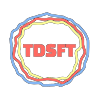

# TDSFT     

> "TDSFT (Two-Dimensional Segmentation Fusion Tool): \
> an extensible and open-source tool for combining different bidimensional annotations."

1. [Description](#description)
2. [Download](#download)
3. [Documentation](#documentation)
4. [Contact us](#contact-us)

## Description ##
*TDSFT* is an open-source tool developed in MATLAB and also distributed as a Standalone application for `MAC`, `Linux`, and `Windows`, which offers a simple and extensible interface where numerous algorithms are proposed to "*mediate*" (*e.g.*, process and fuse) multiple segmentations.

*TDSFT* is:
- `open-source`: everyone can access and use it. Even though it is developed in Matlab, it is distributed as a standalone application, so **you don't need a Matlab license to use it**;
- `easy-to-use`: it is developed to support and help medical specialists during their work;
- `extensible`: it is designed to be easily extendible with new algorithms thanks to a dedicated graphical interface for configuring new parameters.

The following algorithms are implemented:
- [X] Average Smallest And Largest
- [X] Average Target From Input
- [X] Average Target Largest 
- [X] Average Target Smallest
- [X] Largest
- [X] Middle
- [X] Smallest
- [X] [STAPLE](https://www.ncbi.nlm.nih.gov/pmc/articles/PMC1283110/)

For any further information please read the [documentation](#documentation).

## Download ##
*TDSFT* is distributed as a Standalone application for `Windows`, `macOS` (only ARM), and `Linux`. You can download it from `github releases` or from the following [link](https://sourceforge.net/p/tdsft/).

In addition to the standalone application, <ins>at the link above</ins>, you can find also a useful **video tutorial**.

## Documentation ##
See the <ins>documentation file</ins> for the details. You can find this by going to `github releases` or to the following [link](https://sourceforge.net/p/tdsft/). Furthermore, the documentation file is inside the root folder of every standalone application.

## License ##
See the [license file](LICENSE_GENERAL) for the details. \
The [STAPLE implementation](api/fusionAlgorithms/include/STAPLE.m) has its [license file](LICENSE_STAPLE).  
 
## Contact Us ##
- Filippo Piccinini, Istituto Scientifico Romagnolo per lo Studio e la Cura dei Tumori (IRST) IRCCS, Meldola (FC), Italy \
  email: filippo.piccinini@irst.emr.it

- Lorenzo Drudi, Bachelor's Degree Student in Computer Sciences, University of Bologna, Italy \
  email:  &nbsp; lorenzodrudi11@gmail.com \
  github: [@LorenzoDrudi](https://github.com/LorenzoDrudi) \
  LinkedIn: [@drudilorenzo](https://www.linkedin.com/in/drudilorenzo/)
