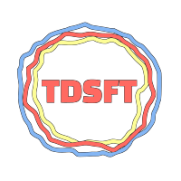

# TDSFT    <br>


[](https://img.shields.io/github/v/release)

> "TDSFT (Two Dimensional Segmentation Fusion Tool): \
> an extensible and open-source tool for combining different bidimensional annotations."

<!-- Add resources/logo/logo_blackbg.svg -->



1. [Description](#description)
2. [Download](#download)
3. [How to use](#how-to-use)
4. [How to extend](#how-to-extend)
5. [License](#license)
6. [Documentation](#documentation)
7. [Acknowledgments](#acknowledgments)
8. [Contact us](#contact-us)

## Description ##
*TDSFT* is an extensible and open-source tool for combining different bidimensional annotations. \
It is a portable *MATLAB Standalone Application* easy to run on `Windows`, `Linux` and `macOs`. \
It permits, using several algorithms, to fuse of different bidimensional segmentations of the same object to obtain the *true segmentation*. 
It is developed for *medical image annotations* but it can be easily applied wherever annotations fusion is needed, e.g. mineral annotations.

*TDSFT* is:
- `easy-to-use`: user-friendly, every design choice was taken to help the user in every-day usage;
- `extensible`: easy to extend by adding external Matlab algorithms (see [here](#how-to-extend));
- `open-source`: everyone can access and use it (see the licenses files).

The following algorithms are implemented (see the documentation for more details):
- [X] Average of smallest and largest segmentations
- [X] Average with target from input
- [X] Average with target the largest segmentation 
- [X] Average with target the smallest segmentation
- [X] Largest segmentation
- [X] Middle segmentation
- [X] Smallest segmentation
- [X] [STAPLE](https://www.ncbi.nlm.nih.gov/pmc/articles/PMC1283110/)

## Download ##
TODO: add standalone app details

## How to use ##

## How to extend ##
*TDSFT* is designed to help users to add their own algorithms without too much effort. 
To do so, just follow the next steps:

1. First of all, you must write the code using [`MATLAB`](https://www.mathworks.com/products/matlab.html);
2. Then, create the source file inside the [algorithms](api/fusionAlgorithms) directory. The filename must follow this pattern: `fusion_{YourName}.m` \
   (substitute `{yourName}` with the name of your algorithm written in camel case, e.g. `fusion_ThisIsMyAlgorithm.m` . \
   See [algorithms](api/fusionAlgorithms) directory for more examples;
3. Inside the source file must be present only one function called as the filename. \
   (e.g. [see here](api/fusionAlgorithms/fusion_Largest.m));
5. Every algorithm takes as input argument a cell array containing all the segmentations. \
   (`Cell array: [1, raters], Cells: matrix [height, width]`);
7. Furthermore, it is possible to create an ad-hoc GUI for user runtime input for your algorithms. \
   If your algorithm requires, in addition to the segmentations array, some other inputs specified at runtime by the user it is possible to create
   a specific input gui to do so. Just follow the next steps:
      1. Create a file called `fusion_{YourName}.json` inside the [inputs](api/fusionAlgorithms/inputs) directory (substitute `{YourName}` with the same name used for the algorithm);
      2. The json file must follow this template:
         ```json
             {
                "inputs": [
                    {
                        "name": "Test DropDown",
                        "type": "DropDown",
                        "value": [
                            "Value 1",
                            "Value 2"
                        ],
                        "help": "This is a help text for the dropdown"
                    },
                    {
                        "name": "Test Check",
                        "type": "Check",
                        "help": "This is a help text for the check"
                    }, 
                    {
                        "name": "Test Text",
                        "type": "Text",
                        "help": "This is a help text for the text"
                    },
                    {
                        "name": "Target Segmentation Index",
                        "type": "InputSegmentationsSelector",
                        "help": "This is a help text for the text"
                    },
                    {
                        "name": "Test Numeric Text",
                        "type": "Number",
                        "value": 1,
                        "limits": [1, 5],
                        "help": "This is a help text for the text"
                    }
                ]
            } 
         ```
         This is an overview of all the components available:
         1. DropDown-> DropDown Menu with values specified using the `value` key (see the example above);
         2. Check -> CheckBox;
         3. Text -> Text Field;
         4. InputSegmentationsSelector -> number edit field which permits to select one of the input segmentations;
         5. Number -> Number edit field with range specified with the `limits` key (see the example above).

## Documentation ##
See the [documentation file]() for the details.

## License ##
See the [license file](LICENSE_GENERAL) for the details. \
The [STAPLE implementation](api/fusionAlgorithms/include/STAPLE.m) has its own [license file](LICENSE_STAPLE).

## Acknowledgments ##
- Lorenzo Drudi, Bachelor's Degree Student in Computer Sciences, University of Bologna, Italy \
  email:  &nbsp; lorenzodrudi11@gmail.com \
  github: [@LorenzoDrudi](https://github.com/LorenzoDrudi)
  
## Contact Us ##
The Data Science for Health (DS4H) group:
- Antonella Carbonaro, Department of Computer Science and Engineering (DISI), University of Bologna, Bologna, Italy \
  email: antonella.carbonaro@unibo.it

- Filippo Piccinini, Istituto Scientifico Romagnolo per lo Studio e la Cura dei Tumori (IRST) IRCCS, Meldola (FC), Italy \
  email: filippo.piccinini@irst.emr.it
  
